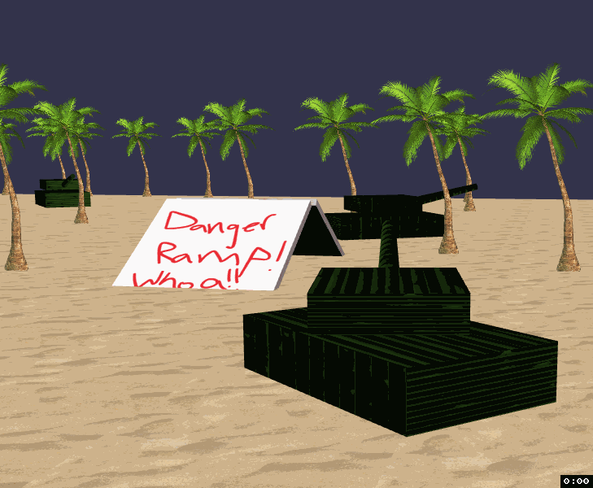

# Todo

- Start screen
  - full screen button (f11 equivalent and also gets focus onto the game controls yay)  
- ai tanks should try to shoot you
  - basic path finding (to avoid blockades) and turret control to gradually try to get you. could also just keep simple and have them move only turret for now
  - ultimate would be to use reinforcement learning train the ai to effectively defeat the player, but...yeah, baby steps.
- limited ammo
  - have to pick up ammo boxes that contain 1 ammo (label it with the bullet texture)--occassionally give an easter egg ammo box!
- github repo that gives Jane PR ability, but not access to master
  - give Jane/Tim/Josh access to submit PRs, although I think PR is open to anyone on github, so yay

# Bugs

  - camera rotation offset gets wonked up if tank rotates
    - seems it happens if the tank rotates from the physics engine, so this might go away if you use the physics engine to control it too
      - but not sure if that's what makes sense to do. so maybe get it fixed before doing that and feel it out...

# Lower priority ideas:

  - reset game should not leak...need to dispose scene/engine probably. if you press "R" a bunch, it takes up butt load of memory on the tab
  - easily add new bullet types:
    - array of bullet types
    - each has texture image, speed, size
  - bullet types should have damage! so as you hit the tank more and more it will _eventually_ explode
  - if you flip, you die
    - key off of tank body rotation and velocity--wait for it to be between some upside down threshold _and_ not moving--if they roll all the way over somehow, that's fine
  - tank turret and barrel should have physicsImposter too so when it rolls over it doesn't just fall to the ground...
  - jane requests:
    - balls should get bigger when they come out of the barrel (start them tiny and animate growth)
    - every 2-15 shots, shoot random object
      - a _literal_ easter egg
        - ellipsoid with easter egg texture should do it
    - make tank a fuzzy cheeto texture (learn how to make fur/hair 3 dimensional)
    - something should leave behind a trail
      - perhaps giant snails...their purpose could be nothing or maybe a wall to block beach balls lol
      - or perhaps the tanks could leave behind a rainbow trail that gradually disappears
    - confetti explosion on impact
      - use particle system probably with lots of velocity
  - sounds effect when shooting and plopping down (BOOM! or like lip pop/lolipop pop)
  - add levels
   - just add more tanks, different courses. But to start, just have one course and like a few tanks
  - randomly generate course, given parameters like { numRamps, numTankEnemies, numBlockades }
  - add some terrain features--hills to drive up and down, roll over on--apply physics to them somehow...
  - use applyImpulse to drive tank instead, so it slows down going up hills/ramps and rolls over more realistically
  - when tank gets hit, bust it up into 3 pieces (disconnect it, then apply impulse to all its parts with random vectors)
  - bullet should dispose if it gets too far down the y axis...rather than making it disappear after some misc time
  - organize code better into classes. put into separate git repo like dirt ball
  - mobile phone support (if no keyboard/has-touch screen)
    - tilt device to turn
    - on screen spacebar to shoot
  - vr support
    - if person moves, snap camera back to top of the tank where commander would sit. but allow them to turn their head/torso of course to look around
    - left joystick controls tank body movement, right joystick controls turret, right trigger shoots